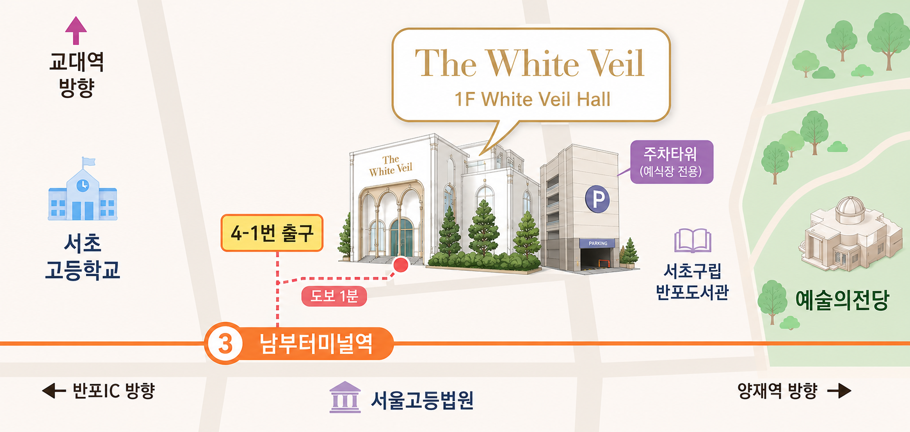

<!doctype html>
<html lang="ko">
  <head>
    <link rel="icon" href="asset/image/common/favicon.svg" type="image/svg+xml" />
    <meta charset="utf-8" />
    <meta name="viewport" content="width=device-width,initial-scale=1" />
    <title>The Wedding Day : 낙훈 & 민영</title>
    <meta property="og:title" content="낙훈 · 민영 결혼합니다" />
    <meta property="og:description" content="2026.08.29 | 저희의 새로운 시작을 축하해 주세요." />
    <meta property="og:image" content="asset/image/1/main-image.jpg" />
    <meta property="og:image:width" content="800" />
    <meta property="og:image:height" content="1200" />
    <!-- Google Fonts -->
    <link href="https://fonts.googleapis.com/css2?family=Cormorant+Garamond:wght@400;700&family=Noto+Serif+KR:wght@400;700&family=Noto+Sans+KR:wght@400;700&display=swap" rel="stylesheet">
    <link rel="stylesheet" href="css/variables.css">
    <link rel="stylesheet" href="css/reset.css">
    <link rel="stylesheet" href="css/base.css">
    <link rel="stylesheet" href="css/sections/cover.css">
    <link rel="stylesheet" href="css/sections/intro.css">
    <link rel="stylesheet" href="css/sections/calendar.css">
    <link rel="stylesheet" href="css/sections/gallery.css">
    <link rel="stylesheet" href="css/sections/location.css">
    <link rel="stylesheet" href="css/sections/account.css">
    <link rel="stylesheet" href="css/sections/share.css">
    
    <!--  -->
  </head>
  <body>
    
    <main id="app">
      <section id="cover" class="section cover" aria-label="Cover">

        <!-- 사진 영역 -->
        

          

            
            

 

          <h1 class="cover__title" id="cover__title">Our Beginning</h1>
        

        <!-- 하단 정보 영역 -->
        

          

          

          

        

      </section>

      <section id="greeting" class="section greeting" aria-label="Invitation">

        <!-- 종이 질감 배경 -->
        

        <!-- 상단 그라데이션 페이드 -->
        

        

          <!-- 상단 divider -->
          

            
          

          <!-- 타이틀 -->
          <h2 class="title">Invitation</h2>

          <!-- 인사말 -->
          

        

        <!-- 중간 사진 (풀 width — inner 밖) -->
        

          

            
            

 

        

        

          <!-- 혼주 정보 -->
          

          <!-- 하단 divider -->
          

            
          

        

        <!-- 하단 그라데이션 페이드 -->
        

      </section>

      <section id="calendar" class="section calendar" aria-label="Wedding Day">

        

          <h2 class="title">Wedding Day</h2>
          

          <table class="calendar__table" role="grid" aria-label="달력">
            <thead>
              <tr id="calHead"></tr>
            </thead>
            <tbody id="calBody"></tbody>
          </table>
        

      </section>

      

        
      

      <section id="location" class="section location" aria-label="Location">

        

          <!-- 타이틀 -->
          <h2 class="title">Location</h2>

          <!-- 예식장명 -->
          

          <!-- 주소 -->
          <address class="location__address"></address>

          <!-- 약도 이미지 -->
          

            
          

          <!-- 길찾기 버튼 3개 -->
          

            <!-- T MAP -->
            

            <!-- 카카오맵 -->
            

            <!-- 네이버지도 -->
            

          

          <!-- 교통편 안내 -->
          

        

      </section>

      <!-- 하단 divider -->
      

        
      

      <section class="section gallery" aria-label="Gallery">

        <h2 class="title">Gallery</h2>

        <!-- JS가 동적으로 채움 -->
        

        
        

      </section>

      

        
      

      <!-- 라이트박스: body 직접 자식 (position:fixed가 overflow에 갇히지 않도록) -->
      

        <!-- 닫기 버튼 -->
        <button class="lightbox__close" id="lightboxClose" aria-label="닫기" type="button">
          <svg width="20" height="20" viewBox="0 0 24 24" fill="none"
              stroke="currentColor" stroke-width="2.5" stroke-linecap="round">
            <line x1="18" y1="6" x2="6" y2="18"/>
            <line x1="6" y1="6" x2="18" y2="18"/>
          </svg>
        </button>

        <!-- 슬라이드 트랙 -->
        

          

 
        

        <!-- 이전/다음 버튼 -->
        <button class="lightbox__arrow lightbox__prev" id="lightboxPrev"
                aria-label="이전 사진" type="button">
          <svg width="20" height="20" viewBox="0 0 24 24" fill="none"
              stroke="currentColor" stroke-width="2.5" stroke-linecap="round" stroke-linejoin="round">
            <polyline points="15 18 9 12 15 6"/>
          </svg>
        </button>

        <button class="lightbox__arrow lightbox__next" id="lightboxNext"
                aria-label="다음 사진" type="button">
          <svg width="20" height="20" viewBox="0 0 24 24" fill="none"
              stroke="currentColor" stroke-width="2.5" stroke-linecap="round" stroke-linejoin="round">
            <polyline points="9 18 15 12 9 6"/>
          </svg>
        </button>

        <!-- 카운터 -->
        

      

      <section id="account" class="section account" aria-label="Account">
        

          <h2 class="title">Account</h2>

          

          <!-- 신랑측 -->
          

            <button class="accordion__trigger" aria-expanded="false"
                    aria-controls="panelGroom" id="triggerGroom" type="button">
              
                신랑측
              
              
            </button>
            

              

                <!-- account.js가 동적으로 삽입 -->
              

            

          

          <!-- 신부측 -->
          

            <button class="accordion__trigger" aria-expanded="false"
                    aria-controls="panelBride" id="triggerBride" type="button">
              
                신부측
              
              
            </button>
            

              

                <!-- account.js가 동적으로 삽입 -->
              

            

          

        

      </section>

      

        
      

      <!-- 토스트 -->
      

        복사되었습니다
      

      

      <section class="section share">
        
        

          <h2 class="title">Share</h2>
          
          <button type="button" class="btn-share font-default" id="btnCopyLink">
            링크 복사하기
          </button>
          <!-- <button type="button" class="btn-share font-default" id="btnKakaoShare">
            카카오톡으로 공유하기
          </button> -->
        

      </section>
    </main>

    <footer class="footer-credit">
      

        © 2026. Designed & Developed by Minyule. 
        <a href="https://github.com/minyule/wedding-invitation" target="_blank" rel="noopener">
          GitHub
        </a>
      

    </footer>

    
  </body>
</html>
